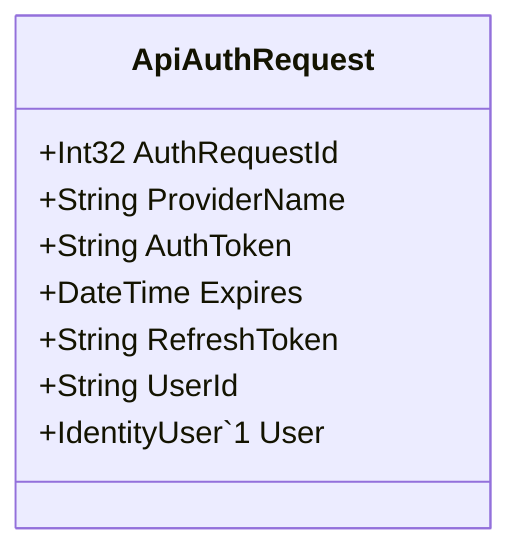

Class Description for <strong>ApiAuthRequest</strong>

<table>
<tr><td> Namespace </td><td> Ovid.Data.Auth.Models.Api </td></tr>
<tr><td> Class Name </td><td> ApiAuthRequest </td></tr>
<tr><td> DLL </td><td> Ovid.Data, Version=1.0.0.0, Culture=neutral, PublicKeyToken=null </td></tr>
<tr><td> Base Type </td><td> System.Object </td></tr>
<table>

<h4>Class Properties</h4>

<table style="width:100%;">
<tr>
<th>Property</th>
<th>Type</th>
<th style="width:40%">Summary</th>
</tr>
<tr>
<td>AuthRequestId</td>
<td>Int32</td>
<td>Record ID</td>
</tr>
<tr>
<td>ProviderName</td>
<td>String</td>
<td>Provider Name</td>
</tr>
<tr>
<td>AuthToken</td>
<td>String</td>
<td>Authentication Token</td>
</tr>
<tr>
<td>Expires</td>
<td>DateTime</td>
<td>Token Expires</td>
</tr>
<tr>
<td>RefreshToken</td>
<td>String</td>
<td>Refresh Token</td>
</tr>
<tr>
<td>UserId</td>
<td>String</td>
<td>User</td>
</tr>
</table>

