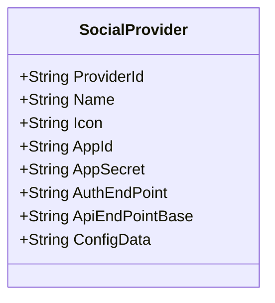

Class Description for <strong>SocialProvider</strong>

<table>
<tr><td> Namespace </td><td> Ovid.Data.Auth.Models.Api </td></tr>
<tr><td> Class Name </td><td> SocialProvider </td></tr>
<tr><td> DLL </td><td> Ovid.Data, Version=1.0.0.0, Culture=neutral, PublicKeyToken=null </td></tr>
<tr><td> Base Type </td><td> System.Object </td></tr>
<table>

<h4>Class Properties</h4>

<table style="width:100%;">
<tr>
<th>Property</th>
<th>Type</th>
<th style="width:40%">Summary</th>
</tr>
<tr>
<td>ProviderId</td>
<td>String</td>
<td>Provider Id</td>
</tr>
<tr>
<td>Name</td>
<td>String</td>
<td>Provider Name</td>
</tr>
<tr>
<td>Icon</td>
<td>String</td>
<td>Icon</td>
</tr>
<tr>
<td>AppId</td>
<td>String</td>
<td>Application Id</td>
</tr>
<tr>
<td>AppSecret</td>
<td>String</td>
<td>Aplication Secret</td>
</tr>
<tr>
<td>AuthEndPoint</td>
<td>String</td>
<td>Auth Endpoint</td>
</tr>
<tr>
<td>ApiEndPointBase</td>
<td>String</td>
<td>Api Base Endpoint</td>
</tr>
<tr>
<td>ConfigData</td>
<td>String</td>
<td>Configuration Data for Provider</td>
</tr>
</table>

