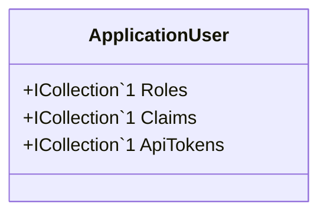

Class Description for <strong>ApplicationUser</strong>

<table>
<tr><td> Namespace </td><td> Ovid.Data.Auth.Models.Users </td></tr>
<tr><td> Class Name </td><td> ApplicationUser </td></tr>
<tr><td> DLL </td><td> Ovid.Data, Version=1.0.0.0, Culture=neutral, PublicKeyToken=null </td></tr>
<tr><td> Base Type </td><td> Microsoft.AspNetCore.Identity.IdentityUser`1[System.String] </td></tr>
<table>

<h4>Class Properties</h4>

<table style="width:100%;">
<tr>
<th>Property</th>
<th>Type</th>
<th style="width:40%">Summary</th>
</tr>
<tr>
<td>Roles</td>
<td>ICollection[[IdentityUserRole`1](Documents/Generated/Microsoft/AspNetCore/Identity/IdentityUserRole`1.md)]</td>
<td>Navigation property for the roles this user belongs to.</td>
</tr>
<tr>
<td>Claims</td>
<td>ICollection[[IdentityUserClaim`1](Documents/Generated/Microsoft/AspNetCore/Identity/IdentityUserClaim`1.md)]</td>
<td>Navigation property for the claims this user possesses.</td>
</tr>
<tr>
<td>ApiTokens</td>
<td>ICollection[[ApiAuthRequest](Documents/Generated/Ovid/Data/Auth/Models/Api/ApiAuthRequest.md)]</td>
<td>Api Authtication Tokens</td>
</tr>
</table>

