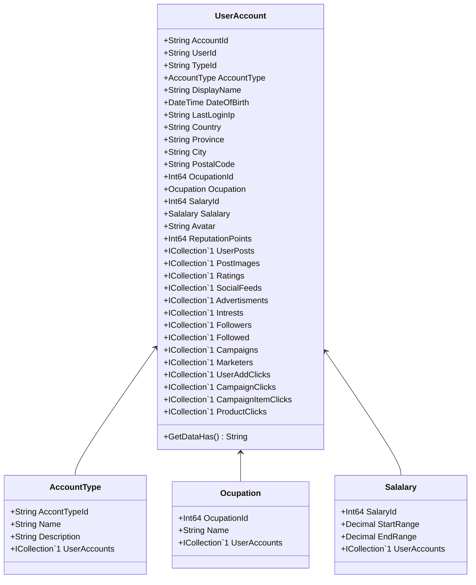

Class Description for <strong>UserAccount</strong>

<table>
<tr><td> Namespace </td><td> Ovid.Data.Models.Accounts </td></tr>
<tr><td> Class Name </td><td> UserAccount </td></tr>
<tr><td> DLL </td><td> Ovid.Data, Version=1.0.0.0, Culture=neutral, PublicKeyToken=null </td></tr>
<tr><td> Base Type </td><td> Ovid.Data.Models.Common.AuditableBase`1[Ovid.Data.Models.Accounts.UserAccount] </td></tr>
<table>

<h4>Class Properties</h4>

<table style="width:100%;">
<tr>
<th>Property</th>
<th>Type</th>
<th style="width:40%">Summary</th>
</tr>
<tr>
<td>AccountId</td>
<td>String</td>
<td>Account Id</td>
</tr>
<tr>
<td>UserId</td>
<td>String</td>
<td>Application User Id</td>
</tr>
<tr>
<td>TypeId</td>
<td>String</td>
<td>Accout Type Id</td>
</tr>
<tr>
<td>AccountType</td>
<td>[AccountType](Documents/Generated/Ovid/Data/Models/Accounts/AccountType.md)</td>
<td>Account Type Nav</td>
</tr>
<tr>
<td>DisplayName</td>
<td>String</td>
<td>Dispplay Name</td>
</tr>
<tr>
<td>DateOfBirth</td>
<td>DateTime</td>
<td>Date Of Birth</td>
</tr>
<tr>
<td>LastLoginIp</td>
<td>String</td>
<td>Last Login Ip</td>
</tr>
<tr>
<td>Country</td>
<td>String</td>
<td>Country</td>
</tr>
<tr>
<td>Province</td>
<td>String</td>
<td>Province / State</td>
</tr>
<tr>
<td>City</td>
<td>String</td>
<td>City</td>
</tr>
<tr>
<td>PostalCode</td>
<td>String</td>
<td>Postal Code</td>
</tr>
<tr>
<td>OcupationId</td>
<td>Int64</td>
<td>Occupation Id</td>
</tr>
<tr>
<td>SalaryId</td>
<td>Int64</td>
<td>/Salary Id</td>
</tr>
<tr>
<td>Salalary</td>
<td>[Salalary](Documents/Generated/Ovid/Data/Models/Common/Salalary.md)</td>
<td>Salary Navigation</td>
</tr>
<tr>
<td>Avatar</td>
<td>String</td>
<td>Avatar</td>
</tr>
<tr>
<td>ReputationPoints</td>
<td>Int64</td>
<td>Reputation Points</td>
</tr>
<tr>
<td>UserPosts</td>
<td>ICollection[[UserPost](Documents/Generated/Ovid/Data/Models/Posts/UserPost.md)]</td>
<td>User Post Nav</td>
</tr>
<tr>
<td>PostImages</td>
<td>ICollection[[PostImage](Documents/Generated/Ovid/Data/Models/Posts/PostImage.md)]</td>
<td>Post Images Nav</td>
</tr>
<tr>
<td>Ratings</td>
<td>ICollection[[AccountRating](Documents/Generated/Ovid/Data/Models/Ratings/AccountRating.md)]</td>
<td>Ratings Nav</td>
</tr>
<tr>
<td>SocialFeeds</td>
<td>ICollection[[SocialFeed](Documents/Generated/Ovid/Data/Models/SocialMedia/SocialFeed.md)]</td>
<td>Social Feeds Nav</td>
</tr>
<tr>
<td>Advertisments</td>
<td>ICollection[[Advertisment](Documents/Generated/Ovid/Data/Models/Advertising/Advertisment.md)]</td>
<td>Adds Nav</td>
</tr>
<tr>
<td>Intrests</td>
<td>ICollection[[UserIntrest](Documents/Generated/Ovid/Data/Models/Accounts/UserIntrest.md)]</td>
<td>Instrest Nav</td>
</tr>
<tr>
<td>Followers</td>
<td>ICollection[[Followed](Documents/Generated/Ovid/Data/Models/Accounts/Followed.md)]</td>
<td>Followers Nav</td>
</tr>
<tr>
<td>Followed</td>
<td>ICollection[[Followed](Documents/Generated/Ovid/Data/Models/Accounts/Followed.md)]</td>
<td>Followed Nav</td>
</tr>
<tr>
<td>Campaigns</td>
<td>ICollection[[Campaign](Documents/Generated/Ovid/Data/Models/Campaigns/Campaign.md)]</td>
<td>Campaigns Nav</td>
</tr>
<tr>
<td>Marketers</td>
<td>ICollection[[Marketer](Documents/Generated/Ovid/Data/Models/Marketers/Marketer.md)]</td>
<td>Marketers Nav</td>
</tr>
<tr>
<td>UserAddClicks</td>
<td>ICollection[[UserAddClick](Documents/Generated/Ovid/Data/Models/Advertising/UserAddClick.md)]</td>
<td>User Add Clicks Nav</td>
</tr>
<tr>
<td>CampaignClicks</td>
<td>ICollection[[UserCampaignClick](Documents/Generated/Ovid/Data/Models/Campaigns/UserCampaignClick.md)]</td>
<td>Campaign Clicks Nav</td>
</tr>
<tr>
<td>CampaignItemClicks</td>
<td>ICollection[[UserCampaignItemClick](Documents/Generated/Ovid/Data/Models/Campaigns/UserCampaignItemClick.md)]</td>
<td>Campaign Item Nav</td>
</tr>
<tr>
<td>ProductClicks</td>
<td>ICollection[[UserProductClick](Documents/Generated/Ovid/Data/Models/Products/UserProductClick.md)]</td>
<td>Product Clicks Nav</td>
</tr>
</table>

<h4>Class Methods</h4>

<table style="width:100%;">
<tr>
<th>Method</th>
<th style="width:40%">Summary</th>
<th>Return</th>
<th>Arguments</th>
</tr>
<tr>
<td>GetDataHash</td>
<td>Get Record Has</td>
<td>String</td>
<td></td>
</tr>

