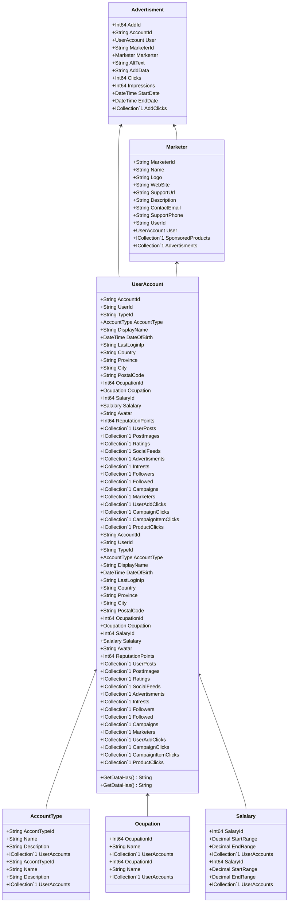

Class Description for <strong>Advertisment</strong>

<table>
<tr><td> Namespace </td><td> Ovid.Data.Models.Advertising </td></tr>
<tr><td> Class Name </td><td> Advertisment </td></tr>
<tr><td> DLL </td><td> Ovid.Data, Version=1.0.0.0, Culture=neutral, PublicKeyToken=null </td></tr>
<tr><td> Base Type </td><td> Ovid.Data.Models.Common.AuditableBase`1[Ovid.Data.Models.Advertising.Advertisment] </td></tr>
<table>

<h4>Class Properties</h4>

<table style="width:100%;">
<tr>
<th>Property</th>
<th>Type</th>
<th style="width:40%">Summary</th>
</tr>
<tr>
<td>AddId</td>
<td>Int64</td>
<td>Add Id</td>
</tr>
<tr>
<td>AccountId</td>
<td>String</td>
<td>Account Id</td>
</tr>
<tr>
<td>User</td>
<td>[UserAccount](Documents/Generated/Ovid/Data/Models/Accounts/UserAccount.md)</td>
<td>User Account Nav</td>
</tr>
<tr>
<td>MarketerId</td>
<td>String</td>
<td>Markerter Id</td>
</tr>
<tr>
<td>Markerter</td>
<td>[Marketer](Documents/Generated/Ovid/Data/Models/Marketers/Marketer.md)</td>
<td>Mareter Nav</td>
</tr>
<tr>
<td>AltText</td>
<td>String</td>
<td>Image Alt Text</td>
</tr>
<tr>
<td>AddData</td>
<td>String</td>
<td>Image Data</td>
</tr>
<tr>
<td>Clicks</td>
<td>Int64</td>
<td>Number of Clicks</td>
</tr>
<tr>
<td>Impressions</td>
<td>Int64</td>
<td>Number of Impressions shown</td>
</tr>
<tr>
<td>StartDate</td>
<td>DateTime</td>
<td>Start Date</td>
</tr>
<tr>
<td>EndDate</td>
<td>DateTime</td>
<td>End Date</td>
</tr>
<tr>
<td>AddClicks</td>
<td>ICollection[[UserAddClick](Documents/Generated/Ovid/Data/Models/Advertising/UserAddClick.md)]</td>
<td>Add Clicks Nav</td>
</tr>
</table>

