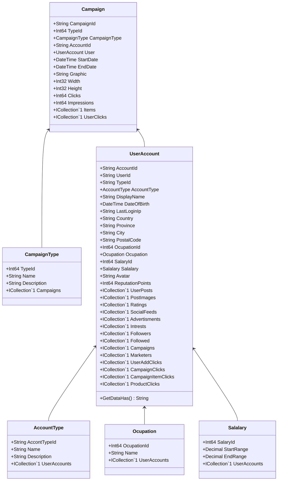

Class Description for <strong>Campaign</strong>

<table>
<tr><td> Namespace </td><td> Ovid.Data.Models.Campaigns </td></tr>
<tr><td> Class Name </td><td> Campaign </td></tr>
<tr><td> DLL </td><td> Ovid.Data, Version=1.0.0.0, Culture=neutral, PublicKeyToken=null </td></tr>
<tr><td> Base Type </td><td> Ovid.Data.Models.Common.AuditableBase`1[Ovid.Data.Models.Campaigns.Campaign] </td></tr>
<table>

<h4>Class Properties</h4>

<table style="width:100%;">
<tr>
<th>Property</th>
<th>Type</th>
<th style="width:40%">Summary</th>
</tr>
<tr>
<td>CampaignId</td>
<td>String</td>
<td>Campaign Id</td>
</tr>
<tr>
<td>TypeId</td>
<td>Int64</td>
<td>Campaign Type Id</td>
</tr>
<tr>
<td>CampaignType</td>
<td>[CampaignType](Documents/Generated/Ovid/Data/Models/Campaigns/CampaignType.md)</td>
<td>Campaign Type Name</td>
</tr>
<tr>
<td>AccountId</td>
<td>String</td>
<td>Account Id</td>
</tr>
<tr>
<td>StartDate</td>
<td>DateTime</td>
<td>Campaign Starts</td>
</tr>
<tr>
<td>EndDate</td>
<td>DateTime</td>
<td>Campaign Ends</td>
</tr>
<tr>
<td>Graphic</td>
<td>String</td>
<td>Banner Image</td>
</tr>
<tr>
<td>Width</td>
<td>Int32</td>
<td>Banner Width</td>
</tr>
<tr>
<td>Height</td>
<td>Int32</td>
<td>Banner Height</td>
</tr>
<tr>
<td>Clicks</td>
<td>Int64</td>
<td>Banner Clicks</td>
</tr>
<tr>
<td>Impressions</td>
<td>Int64</td>
<td>Banner Impressions</td>
</tr>
<tr>
<td>Items</td>
<td>ICollection[[CampaignItem](Documents/Generated/Ovid/Data/Models/Campaigns/CampaignItem.md)]</td>
<td>Items Nav</td>
</tr>
<tr>
<td>UserClicks</td>
<td>ICollection[[UserCampaignClick](Documents/Generated/Ovid/Data/Models/Campaigns/UserCampaignClick.md)]</td>
<td>User Clicks Nav</td>
</tr>
</table>

