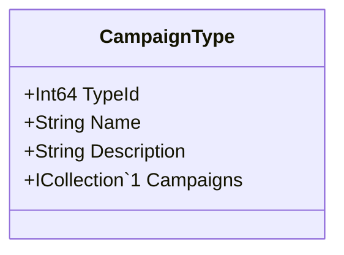

Class Description for <strong>CampaignType</strong>

<table>
<tr><td> Namespace </td><td> Ovid.Data.Models.Campaigns </td></tr>
<tr><td> Class Name </td><td> CampaignType </td></tr>
<tr><td> DLL </td><td> Ovid.Data, Version=1.0.0.0, Culture=neutral, PublicKeyToken=null </td></tr>
<tr><td> Base Type </td><td> System.Object </td></tr>
<table>

<h4>Class Properties</h4>

<table style="width:100%;">
<tr>
<th>Property</th>
<th>Type</th>
<th style="width:40%">Summary</th>
</tr>
<tr>
<td>TypeId</td>
<td>Int64</td>
<td>Record Id</td>
</tr>
<tr>
<td>Name</td>
<td>String</td>
<td>Type Name</td>
</tr>
<tr>
<td>Description</td>
<td>String</td>
<td>Description</td>
</tr>
<tr>
<td>Campaigns</td>
<td>ICollection[[Campaign](Documents/Generated/Ovid/Data/Models/Campaigns/Campaign.md)]</td>
<td>Campaign Nav</td>
</tr>
</table>

