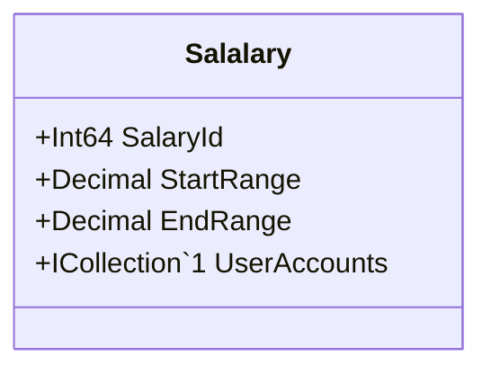

Class Description for <strong>Salalary</strong>

<table>
<tr><td> Namespace </td><td> Ovid.Data.Models.Common </td></tr>
<tr><td> Class Name </td><td> Salalary </td></tr>
<tr><td> DLL </td><td> Ovid.Data, Version=1.0.0.0, Culture=neutral, PublicKeyToken=null </td></tr>
<tr><td> Base Type </td><td> System.Object </td></tr>
<table>

<h4>Class Properties</h4>

<table style="width:100%;">
<tr>
<th>Property</th>
<th>Type</th>
<th style="width:40%">Summary</th>
</tr>
<tr>
<td>SalaryId</td>
<td>Int64</td>
<td>Record Id</td>
</tr>
<tr>
<td>StartRange</td>
<td>Decimal</td>
<td>Start Range</td>
</tr>
<tr>
<td>EndRange</td>
<td>Decimal</td>
<td>End Range</td>
</tr>
<tr>
<td>UserAccounts</td>
<td>ICollection[[UserAccount](Documents/Generated/Ovid/Data/Models/Accounts/UserAccount.md)]</td>
<td>User Account Navigation</td>
</tr>
</table>

