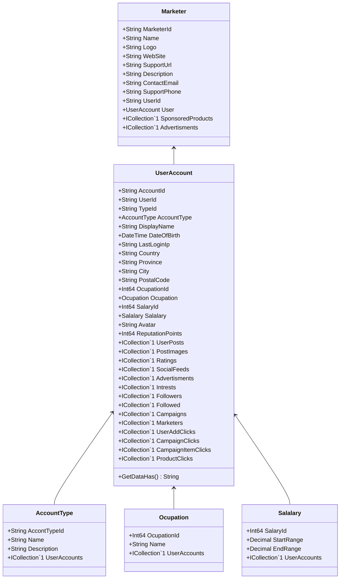

Class Description for <strong>Marketer</strong>

<table>
<tr><td> Namespace </td><td> Ovid.Data.Models.Marketers </td></tr>
<tr><td> Class Name </td><td> Marketer </td></tr>
<tr><td> DLL </td><td> Ovid.Data, Version=1.0.0.0, Culture=neutral, PublicKeyToken=null </td></tr>
<tr><td> Base Type </td><td> Ovid.Data.Models.Common.AuditableBase`1[Ovid.Data.Models.Marketers.Marketer] </td></tr>
<table>

<h4>Class Properties</h4>

<table style="width:100%;">
<tr>
<th>Property</th>
<th>Type</th>
<th style="width:40%">Summary</th>
</tr>
<tr>
<td>MarketerId</td>
<td>String</td>
<td>Marketer Id</td>
</tr>
<tr>
<td>Name</td>
<td>String</td>
<td>Manufacture Name</td>
</tr>
<tr>
<td>Logo</td>
<td>String</td>
<td>Logo</td>
</tr>
<tr>
<td>WebSite</td>
<td>String</td>
<td>Main Web Url</td>
</tr>
<tr>
<td>SupportUrl</td>
<td>String</td>
<td>Support Url</td>
</tr>
<tr>
<td>Description</td>
<td>String</td>
<td>Description</td>
</tr>
<tr>
<td>ContactEmail</td>
<td>String</td>
<td>Contact Email</td>
</tr>
<tr>
<td>SupportPhone</td>
<td>String</td>
<td>Support Phone</td>
</tr>
<tr>
<td>UserId</td>
<td>String</td>
<td>Record Creted By</td>
</tr>
<tr>
<td>SponsoredProducts</td>
<td>ICollection[[SponsoredProduct](Documents/Generated/Ovid/Data/Models/Products/SponsoredProduct.md)]</td>
<td>Products Nav</td>
</tr>
<tr>
<td>Advertisments</td>
<td>ICollection[[Advertisment](Documents/Generated/Ovid/Data/Models/Advertising/Advertisment.md)]</td>
<td>Adds Nav</td>
</tr>
</table>

