```mermaid
classDiagram
	UserPost <-- UserAccount
	UserPost <-- SponsoredProduct
	UserAccount <-- AccountType
	UserAccount <-- Ocupation
	UserAccount <-- Salalary
	SponsoredProduct <-- Marketer
	SponsoredProduct <-- ProductCategory
	Marketer <-- UserAccount
	class UserPost{
		+String PostId
		+String AccountId
		+UserAccount UserAccount
		+String ItemText
		+Int32 ItemRating
		+String ReviewLink
		+String ReviewText
		+String ProductId
		+SponsoredProduct Product
		+String ParentPostId
		+ICollection`1 Ratings
		+ICollection`1 Images
	}
	class UserAccount{
		+String AccountId
		+String UserId
		+String TypeId
		+AccountType AccountType
		+String DisplayName
		+DateTime DateOfBirth
		+String LastLoginIp
		+String Country
		+String Province
		+String City
		+String PostalCode
		+Int64 OcupationId
		+Ocupation Ocupation
		+Int64 SalaryId
		+Salalary Salalary
		+String Avatar
		+Int64 ReputationPoints
		+ICollection`1 UserPosts
		+ICollection`1 PostImages
		+ICollection`1 Ratings
		+ICollection`1 SocialFeeds
		+ICollection`1 Advertisments
		+ICollection`1 Intrests
		+ICollection`1 Followers
		+ICollection`1 Followed
		+ICollection`1 Campaigns
		+ICollection`1 Marketers
		+ICollection`1 UserAddClicks
		+ICollection`1 CampaignClicks
		+ICollection`1 CampaignItemClicks
		+ICollection`1 ProductClicks
		 +GetDataHas() String
	}
	class SponsoredProduct{
		+String ProductId
		+String MarkerterId
		+Marketer Marketer
		+Int64 CategoryId
		+ProductCategory Category
		+String Name
		+String ProductLink
		+String Description
		+String Infromation
		+Decimal Price
		+Decimal InfulencePrice
		+Int64 NumberSold
		+String KeyWords
		+ICollection`1 Images
		+ICollection`1 ProductClicks
	}
	class AccountType{
		+String AccontTypeId
		+String Name
		+String Description
		+ICollection`1 UserAccounts
	}
	class Ocupation{
		+Int64 OcupationId
		+String Name
		+ICollection`1 UserAccounts
	}
	class Salalary{
		+Int64 SalaryId
		+Decimal StartRange
		+Decimal EndRange
		+ICollection`1 UserAccounts
	}
	class Marketer{
		+String MarketerId
		+String Name
		+String Logo
		+String WebSite
		+String SupportUrl
		+String Description
		+String ContactEmail
		+String SupportPhone
		+String UserId
		+UserAccount User
		+ICollection`1 SponsoredProducts
		+ICollection`1 Advertisments
	}
	class ProductCategory{
		+Int64 CategoryId
		+String Name
		+String Icon
		+ICollection`1 Products
	}
	class UserAccount{
		+String AccountId
		+String UserId
		+String TypeId
		+AccountType AccountType
		+String DisplayName
		+DateTime DateOfBirth
		+String LastLoginIp
		+String Country
		+String Province
		+String City
		+String PostalCode
		+Int64 OcupationId
		+Ocupation Ocupation
		+Int64 SalaryId
		+Salalary Salalary
		+String Avatar
		+Int64 ReputationPoints
		+ICollection`1 UserPosts
		+ICollection`1 PostImages
		+ICollection`1 Ratings
		+ICollection`1 SocialFeeds
		+ICollection`1 Advertisments
		+ICollection`1 Intrests
		+ICollection`1 Followers
		+ICollection`1 Followed
		+ICollection`1 Campaigns
		+ICollection`1 Marketers
		+ICollection`1 UserAddClicks
		+ICollection`1 CampaignClicks
		+ICollection`1 CampaignItemClicks
		+ICollection`1 ProductClicks
		 +GetDataHas() String
	}
	class AccountType{
		+String AccontTypeId
		+String Name
		+String Description
		+ICollection`1 UserAccounts
	}
	class Ocupation{
		+Int64 OcupationId
		+String Name
		+ICollection`1 UserAccounts
	}
	class Salalary{
		+Int64 SalaryId
		+Decimal StartRange
		+Decimal EndRange
		+ICollection`1 UserAccounts
	}
```

Class Description for <strong>UserPost</strong>

<table>
<tr><td> Namespace </td><td> Ovid.Data.Models.Posts </td></tr>
<tr><td> Class Name </td><td> UserPost </td></tr>
<tr><td> DLL </td><td> Ovid.Data, Version=1.0.0.0, Culture=neutral, PublicKeyToken=null </td></tr>
<tr><td> Base Type </td><td> Ovid.Data.Models.Common.AuditableBase`1[Ovid.Data.Models.Posts.UserPost] </td></tr>
<table>

<h4>Class Properties</h4>

<table style="width:100%;">
<tr>
<th>Property</th>
<th>Type</th>
<th style="width:40%">Summary</th>
</tr>
<tr>
<td>PostId</td>
<td>String</td>
<td>Post Id</td>
</tr>
<tr>
<td>AccountId</td>
<td>String</td>
<td>User Account</td>
</tr>
<tr>
<td>UserAccount</td>
<td>[UserAccount](Documents/Generated/Ovid/Data/Models/Accounts/UserAccount.md)</td>
<td>User account Nav</td>
</tr>
<tr>
<td>ItemText</td>
<td>String</td>
<td>Item Text</td>
</tr>
<tr>
<td>ItemRating</td>
<td>Int32</td>
<td>Item Rating</td>
</tr>
<tr>
<td>ReviewLink</td>
<td>String</td>
<td>Review Url Link</td>
</tr>
<tr>
<td>ReviewText</td>
<td>String</td>
<td>Review Text</td>
</tr>
<tr>
<td>ProductId</td>
<td>String</td>
<td>Product Id if Sponsored</td>
</tr>
<tr>
<td>ParentPostId</td>
<td>String</td>
<td>Parent post Id</td>
</tr>
<tr>
<td>Ratings</td>
<td>ICollection[[AccountRating](Documents/Generated/Ovid/Data/Models/Ratings/AccountRating.md)]</td>
<td>Rating Nav</td>
</tr>
<tr>
<td>Images</td>
<td>ICollection[[PostImage](Documents/Generated/Ovid/Data/Models/Posts/PostImage.md)]</td>
<td>Images Nav</td>
</tr>
</table>

