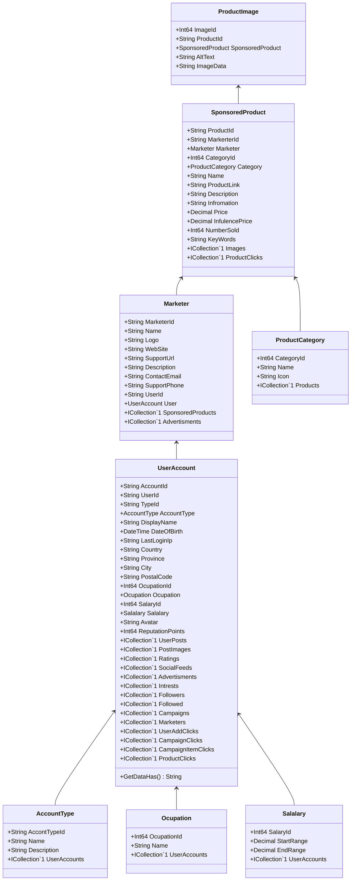

Class Description for <strong>ProductImage</strong>

<table>
<tr><td> Namespace </td><td> Ovid.Data.Models.Products </td></tr>
<tr><td> Class Name </td><td> ProductImage </td></tr>
<tr><td> DLL </td><td> Ovid.Data, Version=1.0.0.0, Culture=neutral, PublicKeyToken=null </td></tr>
<tr><td> Base Type </td><td> Ovid.Data.Models.Common.AuditableBase`1[Ovid.Data.Models.Products.ProductImage] </td></tr>
<table>

<h4>Class Properties</h4>

<table style="width:100%;">
<tr>
<th>Property</th>
<th>Type</th>
<th style="width:40%">Summary</th>
</tr>
<tr>
<td>ImageId</td>
<td>Int64</td>
<td>Image Id</td>
</tr>
<tr>
<td>ProductId</td>
<td>String</td>
<td>Product Id</td>
</tr>
<tr>
<td>SponsoredProduct</td>
<td>[SponsoredProduct](Documents/Generated/Ovid/Data/Models/Products/SponsoredProduct.md)</td>
<td>Product Nav</td>
</tr>
<tr>
<td>AltText</td>
<td>String</td>
<td>Image Alt Text</td>
</tr>
<tr>
<td>ImageData</td>
<td>String</td>
<td>Image Data</td>
</tr>
</table>

