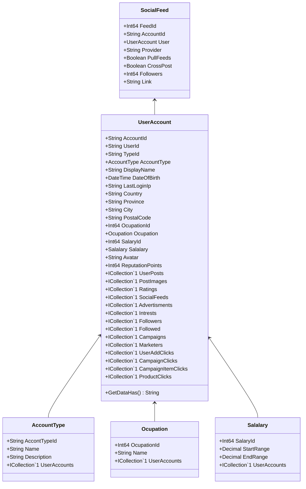

Class Description for <strong>SocialFeed</strong>

<table>
<tr><td> Namespace </td><td> Ovid.Data.Models.SocialMedia </td></tr>
<tr><td> Class Name </td><td> SocialFeed </td></tr>
<tr><td> DLL </td><td> Ovid.Data, Version=1.0.0.0, Culture=neutral, PublicKeyToken=null </td></tr>
<tr><td> Base Type </td><td> Ovid.Data.Models.Common.AuditableBase`1[Ovid.Data.Models.SocialMedia.SocialFeed] </td></tr>
<table>

<h4>Class Properties</h4>

<table style="width:100%;">
<tr>
<th>Property</th>
<th>Type</th>
<th style="width:40%">Summary</th>
</tr>
<tr>
<td>FeedId</td>
<td>Int64</td>
<td>Feed Id</td>
</tr>
<tr>
<td>AccountId</td>
<td>String</td>
<td>Accoutn</td>
</tr>
<tr>
<td>User</td>
<td>[UserAccount](Documents/Generated/Ovid/Data/Models/Accounts/UserAccount.md)</td>
<td>User Account nav</td>
</tr>
<tr>
<td>Provider</td>
<td>String</td>
<td>Provider</td>
</tr>
<tr>
<td>PullFeeds</td>
<td>Boolean</td>
<td>Pull Feeds</td>
</tr>
<tr>
<td>CrossPost</td>
<td>Boolean</td>
<td>Cross Post feeds from this site</td>
</tr>
<tr>
<td>Followers</td>
<td>Int64</td>
<td>Current Followers</td>
</tr>
<tr>
<td>Link</td>
<td>String</td>
<td>External Link</td>
</tr>
</table>

